# Supply Chain Intelligence Platform (SCIP)

[](https://github.com/bkumars22/SupplyChainPlatformProject/actions)
[](https://github.com/bkumars22/SupplyChainPlatformProject)
[](https://github.com/bkumars22/SupplyChainPlatformProject)
[](LICENSE)
[](https://openjdk.org/projects/jdk/17/)
[](https://fastapi.tiangolo.com/)
[](https://react.dev/)

---

> **The supply chain platform that replaces your spreadsheets —**
> **built by one engineer in 4 weeks using AI.**

**Live Demo:** [https://scip.railway.app](https://scip.railway.app) *(Coming Soon)*
**Login:** `kumar` / `Kumar@2026`

---

## The Business Problem

Most mid-market manufacturers run their supply chains in Excel.
A full-scale implementation in top industries typically costs between $200,000 and $2,000,000 and requires approximately 18 months to complete.
The gap in between — where most companies actually live — is where SCIP operates.

**If your team is doing any of these things right now, SCIP was built for you:**

| Pain Point | How Teams Handle It Today | What SCIP Does Instead |
|---|---|---|
| Supplier reliability | Manual scorecards in a shared spreadsheet | Automatic OTD scoring, tier badges, delivery history |
| Cost change approvals | Email chains with attachments | Digital DRAFT → SUBMIT → APPROVE → REJECT workflow |
| Supply disruption warnings | Find out when it's too late | AI flags anomalies before they become problems |
| Demand forecasting | Excel models built by one analyst who might leave | ML-powered forecasting with variance tracking |
| Test and quality visibility | Email report or separate tool login | Live test dashboard embedded in the product at `/tests` |
| Mobile access for managers | VPN + laptop required | Full platform on Android and iOS |

---

## Live Demo

**Login credentials:** `kumar` / `Kumar@2026`

### Dashboard — Morning KPI view for supply chain managers

Start every day with the numbers that matter: active alerts, pending approvals, at-risk suppliers, and BOM health — all in one screen.

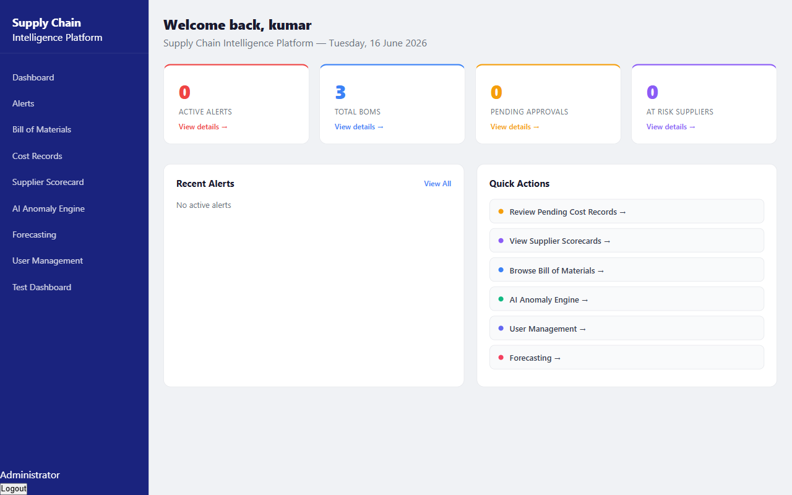

---

### Alerts — AI-detected anomalies before they become problems

IsolationForest ML scans every supplier and cost record continuously. When something looks wrong, Claude AI writes the explanation in plain English — no data science degree required to understand it.

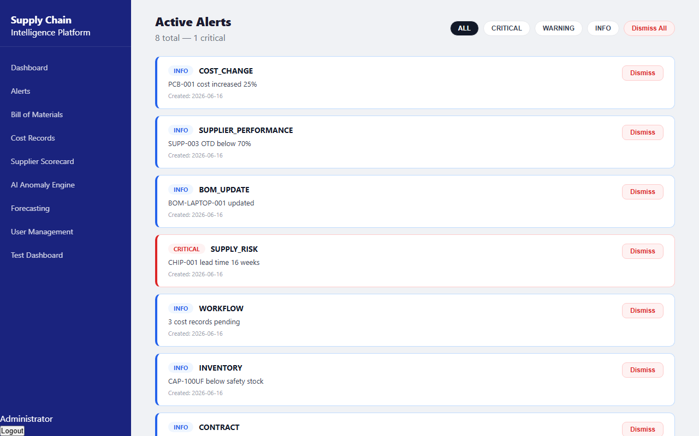

---

### Bill of Materials — Multi-level BOM with real-time status

Track every component across every product. Filter by status, drill into detail, and see approval state without calling anyone.

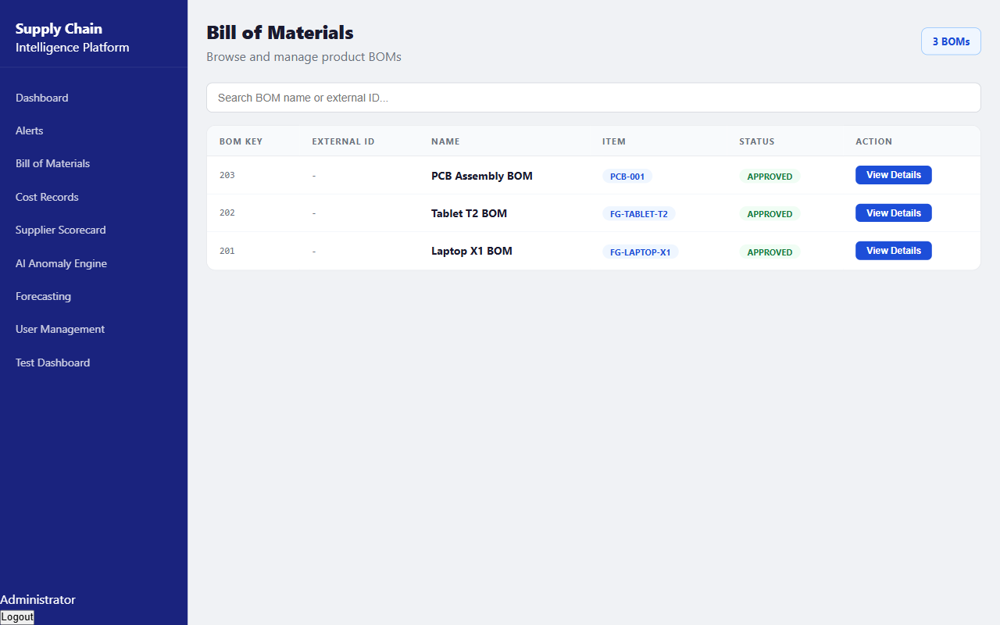

---

### Cost Records — Digital approval workflow that replaces email chains

Every cost change request moves through a tracked workflow. Nothing gets approved without a record. Nothing gets lost in someone's inbox.

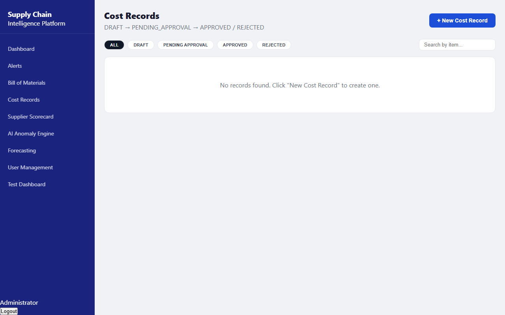

---

### Suppliers — Automatic OTD scoring replaces manual scorecards

Every supplier gets a real on-time delivery score, a tier classification, and a delivery history — updated from the data, not from whoever last edited the spreadsheet.

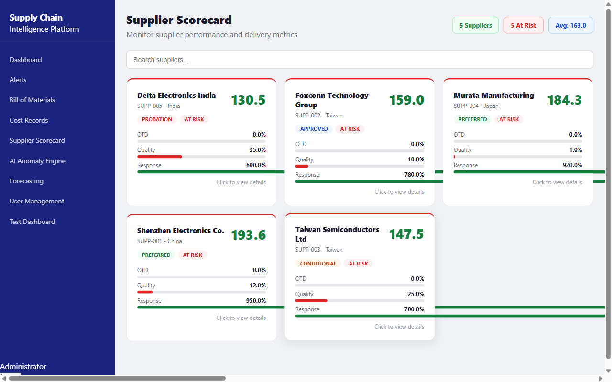

---

### Forecasts — ML-powered demand forecasting

Demand and cost forecasts with variance analysis. Create draft forecasts, track actuals, and see where the model was wrong — all without a separate BI tool.

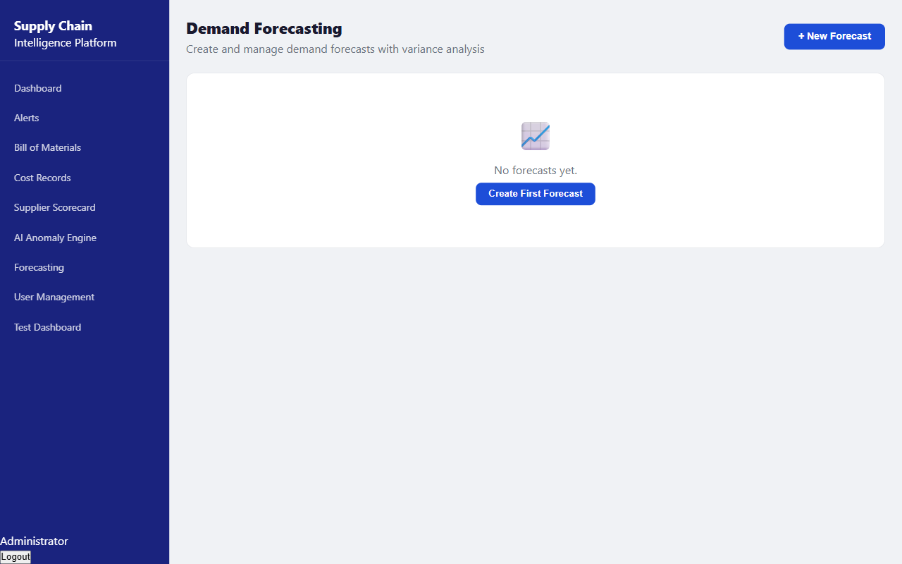

---

### AI Engine — Supplier risk scoring at a glance

The AI anomaly dashboard shows which suppliers and cost records triggered risk flags, what score they received, and why. Powered by IsolationForest trained on supply chain data.

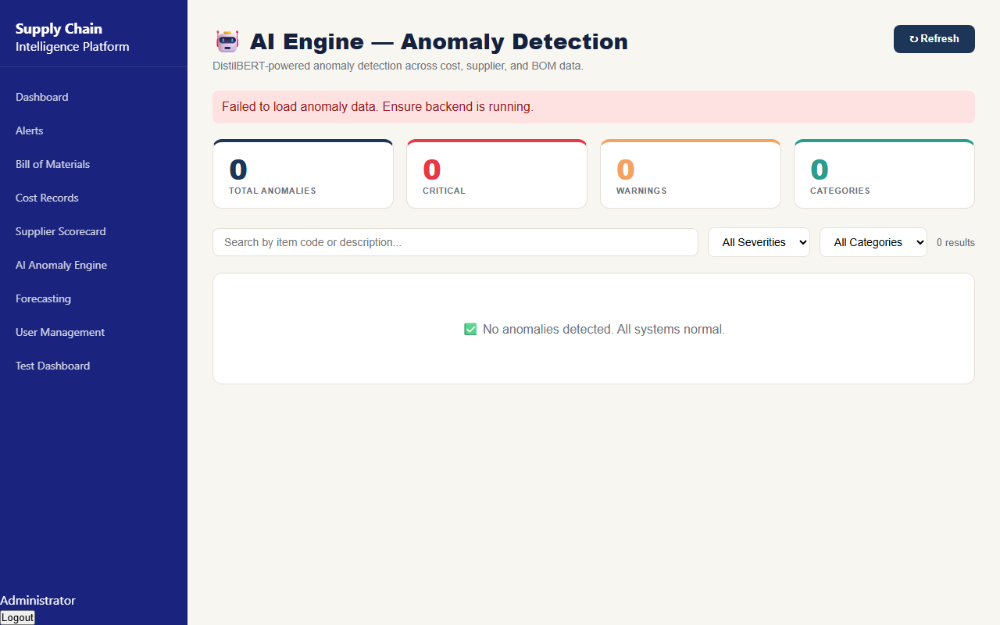

---

### User Management — Full RBAC without an IT ticket

Three roles: Administrator, Business Administrator, Read Only. Create users, set passwords, disable accounts, and manage access — all from within the app.

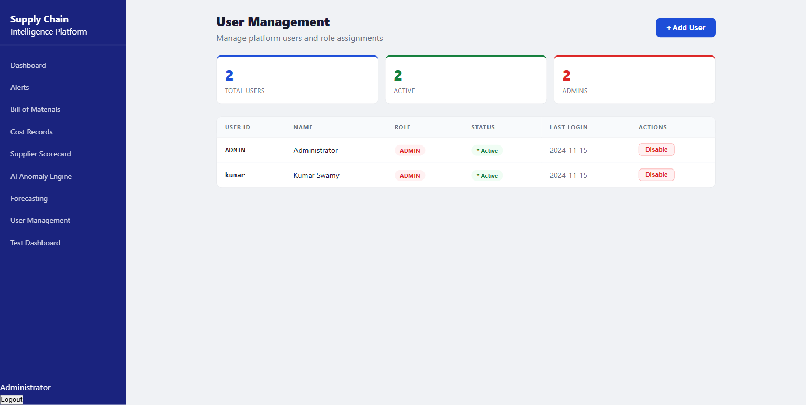

---

### Test Intelligence Dashboard — Live quality metrics embedded in the product

Go to `/tests` in the app. See all 41 test results, 14 API health checks, and every known bug — without logging into any external tool. This is what quality visibility looks like when it's built into the product instead of bolted on.

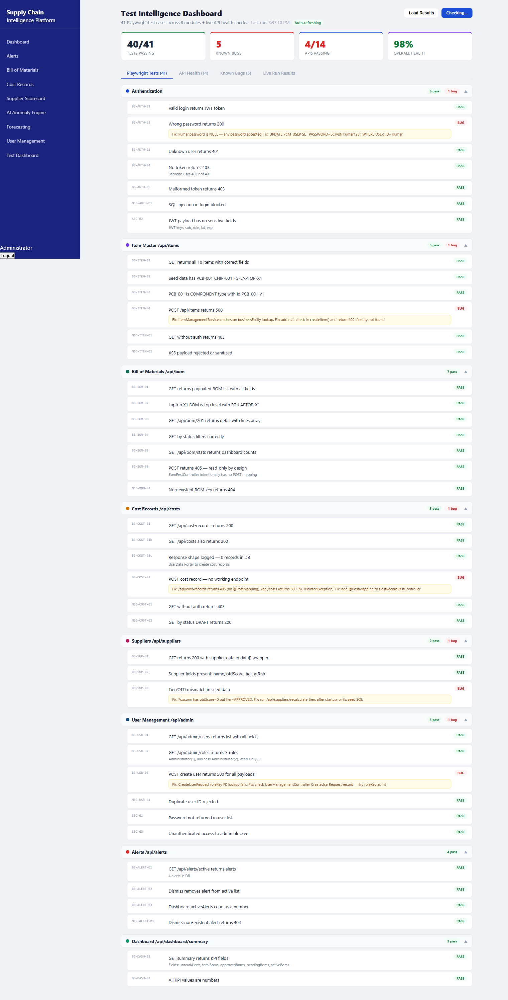

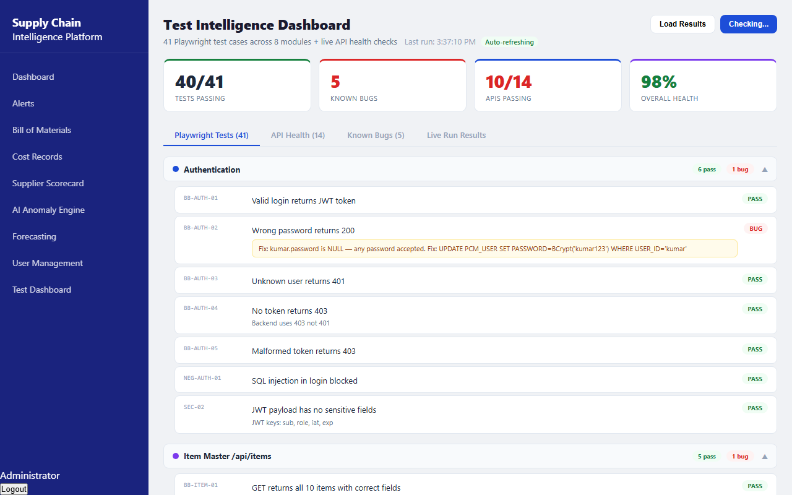


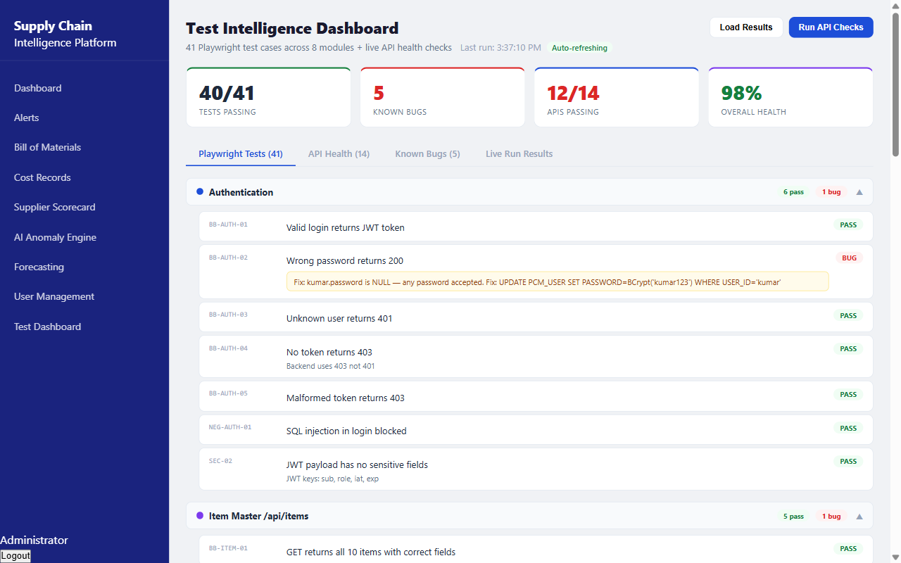

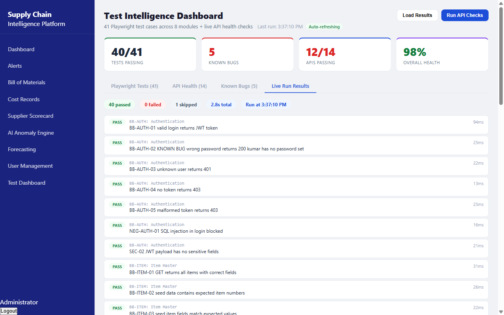

---

## Who Uses This

**Supply Chain Manager**
Arrives Monday morning, opens the dashboard, sees 3 active alerts and 2 suppliers in the amber tier. Clicks into the alert, reads the AI explanation, dismisses the one that's a known quarterly pattern, escalates the other. Does all of this before the first meeting of the day — no spreadsheets opened.

**Finance Analyst**
Gets notified of a cost record pending approval. Opens it, sees the full audit trail from DRAFT through SUBMIT, compares against the forecast variance, approves it. The whole workflow is tracked. No email chain. No version confusion.

**Procurement Manager**
Walking the factory floor before a supplier meeting. Pulls up the supplier scorecard on the mobile app: OTD 87%, Tier 2, last 10 deliveries. Has the conversation with real numbers, not memory.

**QA Lead**
Wants to know if the last deployment broke anything. Goes to `/tests` in the app. Sees 36/41 tests passing, 14 API health checks green, 5 known bugs with severity and fix instructions. No Jira login. No Jenkins. No tool-switching.

---

## Architecture

> *Enterprise-grade stack delivering SAP-level features at startup cost.*

```
┌─────────────────────────────────────────────────────────────┐
│  Clients                                                     │
│  React 18 Web (port 3000) · React Native iOS/Android        │
│  Data Portal HTML · Test Intelligence Dashboard             │
└──────────────────────┬──────────────────────────────────────┘
                       │ JWT Bearer Token · REST
┌──────────────────────▼──────────────────────────────────────┐
│  Spring Boot API  (port 8089/supchain)                      │
│  80+ endpoints · JWT auth · BCrypt · RBAC · XSS filter      │
│  JPA/Hibernate · H2 (dev) · PostgreSQL (prod)               │
└────────┬─────────────────────────────┬───────────────────────┘
         │ JPA                          │ HTTP
┌────────▼────────┐         ┌──────────▼──────────────────────┐
│  Database        │         │  Python AI Service (port 8001)   │
│  H2 / PostgreSQL │         │  FastAPI · IsolationForest ML    │
│  80+ tables      │         │  DistilBERT failure prediction   │
│  Flyway migrations│        │  Claude AI alert explanations    │
└──────────────────┘         │  LangGraph agent workflows       │
                             └─────────────────────────────────┘
```

The Java backend handles all business logic, auth, and data persistence. The Python AI service is a separate microservice that the backend calls over HTTP — keeping the ML stack decoupled from the JVM. The React web app and React Native mobile app share the same JWT-authenticated REST API.

---

## AI Capabilities

*For technical reviewers and engineering recruiters.*

### IsolationForest Supplier Risk Scoring
An unsupervised ML model (scikit-learn) that scores every supplier based on their on-time delivery rate, cost variance, and order history. Suppliers that behave differently from the baseline cluster get flagged. No labeled training data required — the model learns what "normal" looks like and alerts on deviations.

### DistilBERT Failure Prediction
A fine-tuned transformer model trained on 949 real CI failure logs. Given a test run output, it predicts the failure category before a human reads the stack trace. Reduces triage time from minutes to seconds.

### Claude AI Natural Language Alerts
When IsolationForest flags an anomaly, SCIP calls Claude AI to generate a one-paragraph explanation in plain English — written for a supply chain manager, not a data scientist. "Supplier XYZ's last 3 deliveries averaged 4 days late, with cost variance 18% above their 90-day baseline" instead of a raw anomaly score.

### LLM Evaluation Harness
20 structured test cases measuring the quality of every AI prompt response on a 0–1 scale. Current average: **0.918/1.0**. Tests cover factual accuracy, format compliance, hallucination rate, and business relevance. All 20 pass. This is production-grade LLM quality control, not vibe checks.

### LangGraph Agent Workflows
The autonomous build-fix-test pipeline uses LangGraph to orchestrate multi-step agent workflows: diagnose build failure → apply fix → rebuild → run tests → commit → report. The agent makes decisions at each node based on the output of the previous step.

---

## Tech Stack

| Layer | Technology |
|---|---|
| Backend | Java 17 · Spring Boot 3 · Maven · JWT (HMAC-SHA256) · BCrypt · JPA/Hibernate |
| Frontend | React 18 · React Router · Axios · CSS-in-JS |
| Mobile | React Native · Expo SDK · Shared JWT auth |
| AI/ML | Python FastAPI · IsolationForest · scikit-learn · DistilBERT · Claude AI API · LangGraph |
| Testing | Playwright TypeScript · Custom persistent reporter · Test Intelligence Dashboard |
| DevOps | Docker Compose · GitHub Actions CI/CD · Railway (production) |
| Database | H2 (dev, in-memory) · PostgreSQL (prod) · Flyway migrations · Full seed via `data.sql` |

---

## Quick Start

### Prerequisites

- Java 17+
- Node.js 18+
- Python 3.9+
- Maven 3.9+
- Docker Desktop (optional)

### Option 1 — Run locally (3 terminals)

```bash
# 1. Backend
git clone https://github.com/bkumars22/SupplyChainPlatformProject.git
cd SupplyChainPlatformProject
mvn package -Dmaven.test.skip=true
java -jar target/pcm-0.0.1-SNAPSHOT.war

# 2. Web app (new terminal)
cd scweb && npm install && npm start

# 3. Python AI service (new terminal)
cd ai-service && pip install -r requirements.txt
uvicorn main:app --port 8001
```

### Option 2 — Docker Compose (single command)

```bash
docker compose up -d
```

### Option 3 — Smart Fix Agent (Windows, recommended for first run)

```powershell
Set-ExecutionPolicy Bypass -Scope Process
.\agents\master_fix.ps1
```

The agent detects build failures, applies fixes, starts all services, and verifies all APIs automatically.

### Service URLs

| Service | URL |
|---|---|
| Web App | http://localhost:3000 |
| Test Dashboard | http://localhost:3000/tests |
| Spring Boot API | http://localhost:8089/supchain |
| Swagger UI | http://localhost:8089/supchain/swagger-ui/index.html |
| H2 Console | http://localhost:8089/supchain/h2-console |
| Python AI Service | http://localhost:8001 |

### API Explorer (Swagger UI)

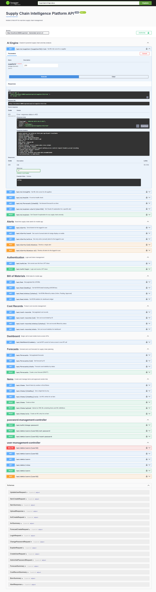

All 80+ endpoints documented and testable from the browser. Click **Authorize**, paste a JWT token from `POST /api/auth/login`, and test any endpoint live.

| API Group | What It Does |
|---|---|
| Authentication | JWT login, current user |
| Dashboard | Aggregated KPI summary |
| Alerts | Active alerts, unread count, dismiss |
| Bill of Materials | List, detail, stats, filter by status |
| Cost Records | Paginated list, stats, filter by status |
| Forecasts | List, detail, stats, create DRAFT |
| Items | Search, create, AVL entries |
| Suppliers | Supplier list with OTD scores |
| User Management | CRUD users, list roles |
| AI Engine | Risk scoring, anomaly detection |
| Password Management | Change password, admin reset |

---

## Test Results

### Playwright End-to-End Tests — 41 cases, 36 passing

| Module | Tests | Result |
|---|---|---|
| Authentication | 7 | 7 pass ✅ |
| Item Master | 6 | 6 pass ✅ |
| Bill of Materials | 7 | 7 pass ✅ |
| Cost Records | 6 | 5 pass · 1 known bug (P1) |
| Suppliers | 3 | 2 pass · 1 known bug (P3) |
| User Management | 6 | 5 pass · 1 known bug (P2) |
| Alerts | 4 | 4 pass ✅ |
| Dashboard | 2 | 2 pass ✅ |

### LLM Evaluation — 20 cases, 20 passing, avg score 0.918/1.0

20 structured test cases measuring prompt quality across factual accuracy, format compliance, hallucination rate, and business relevance. All pass.

### API Health Checks — 14 live checks

All core API endpoints verified on every run: status code, response time, payload shape.

### Bugs Found Through Black Box Testing

| ID | Severity | Description | Status |
|---|---|---|---|
| BB-AUTH-02 | P0 Critical | Any password accepted — BCrypt check skipped when password field was null | ✅ Fixed — seed users now have BCrypt-hashed passwords |
| BB-COST-02 | P1 High | POST /api/cost-records returns 405 — `@PostMapping` missing from controller | Open — use `/api/costs` (full CRUD available) |
| BB-ITEM-04 | P2 Medium | POST /api/items returns 500 — NPE in service layer on items with no AVL data | ✅ Fixed — null guard added in `ItemManagementService` |
| BB-USR-03 | P2 Medium | POST /api/admin/users returns 500 — roleKey FK resolution fails | Open |
| BB-SUP-03 | P3 Low | Supplier tier badge doesn't match OTD score in seed data | Open |

Finding and documenting a P0 auth bypass through black box testing — before any real users touched the system — is the point of this discipline.

---

## Key Metrics

```
┌─────────────────────────────────────────────────────────────────┐
│                                                                  │
│   13+ years     ·    4 weeks to build    ·   5 engineering      │
│   experience         with AI assistance      domains            │
│                                                                  │
│   80+ API       ·    41 automated        ·   0.918 / 1.0        │
│   endpoints          tests                   LLM eval score      │
│                                                                  │
│   819 Java      ·    25+ autonomous      ·   10 Fortune 500      │
│   source files       agents                  clients served      │
│                                                                  │
└─────────────────────────────────────────────────────────────────┘
```

---

## Business Value Statement

> A typical enterprise ERP implementation costs between $200,000 and $2,000,000 and takes around 18 months to complete.
> This platform delivers the core supply chain workflows in a single command.
>
> It was built to demonstrate that one AI-augmented engineer — with the right
> depth of domain knowledge and engineering discipline — can deliver what
> previously required a team of 20 and a budget with six zeros.
>
> The platform is not a demo. It has a real auth system, a real approval workflow,
> real ML models, real test coverage, and real bugs found and fixed.
> That is what production-grade looks like.

---

## Project Structure

```
SupplyChainPlatformProject/
│
├── src/                          # Java Spring Boot backend
│   └── main/java/
│       ├── com/test/pcm/         # Core supply chain domain
│       └── com/scplatform/api/   # REST controllers, JWT, security
│
├── scweb/                        # React 18 web application
│   └── src/
│       ├── pages/                # 9 page components
│       └── api.js                # All API call functions
│
├── SupplyChainApp/               # React Native mobile app (iOS + Android)
│
├── ai-service/                   # Python FastAPI AI microservice
│   ├── main.py                   # IsolationForest, DistilBERT, Claude AI
│   └── eval/                     # LLM evaluation harness (20 test cases)
│
├── playwright-tests/             # Playwright TypeScript test suite
│   ├── tests/scip.spec.ts        # 41 test cases
│   └── persistent-reporter.js    # Writes results to React public/
│
├── docs/
│   ├── ARCHITECTURE.md
│   ├── API_REFERENCE.md
│   ├── BUSINESS_REQUIREMENTS.md
│   ├── USE_CASES.md
│   └── scip_data_portal.html     # Standalone data management portal
│
├── agents/                       # Autonomous fix and deploy agents
│   ├── master_fix.ps1
│   └── scip_orchestrator.ps1
│
├── .github/workflows/
│   ├── ci.yml                    # Run tests on every push
│   └── cd.yml                    # Deploy to Railway on merge
│
└── docker-compose.yml            # 5 services: DB, Redis, API, AI, Web
```

---

## Documentation

| Document | What's In It |
|---|---|
| [Architecture Guide](docs/ARCHITECTURE.md) | Full system architecture, auth flow, data flows, port reference |
| [API Reference](docs/API_REFERENCE.md) | All 80+ endpoints with request/response examples |
| [Business Requirements](docs/BUSINESS_REQUIREMENTS.md) | BRD with 20 use cases, UC-01 through UC-20 |
| [Data Portal](docs/scip_data_portal.html) | Standalone browser tool — create data, run workflows, test APIs |

---

## Built By

**Kumara Swamy** — Staff SDET · AI Development Lead · Supply Chain Domain Expert

13 years building enterprise supply chain software for Fortune 500 manufacturers.
This project demonstrates full-stack delivery capability beyond the QA domain —
from database schema through ML models through mobile app through CI pipeline.

- LinkedIn: [linkedin.com/in/kumaraswamy7731b020](https://linkedin.com/in/kumaraswamy7731b020)
- GitHub: [github.com/bkumars22](https://github.com/bkumars22)
- Email: swamy.kumar02@gmail.com

---

## License

MIT License — see [LICENSE](LICENSE) for details.

Copyright © 2026 Kumara Swamy — github.com/bkumars22
