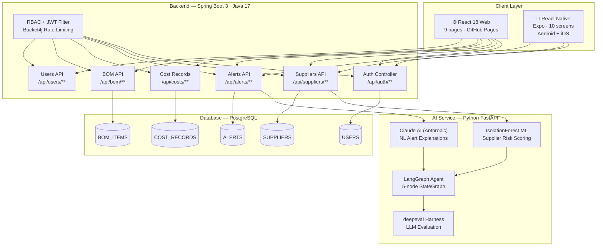
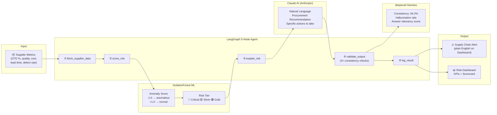
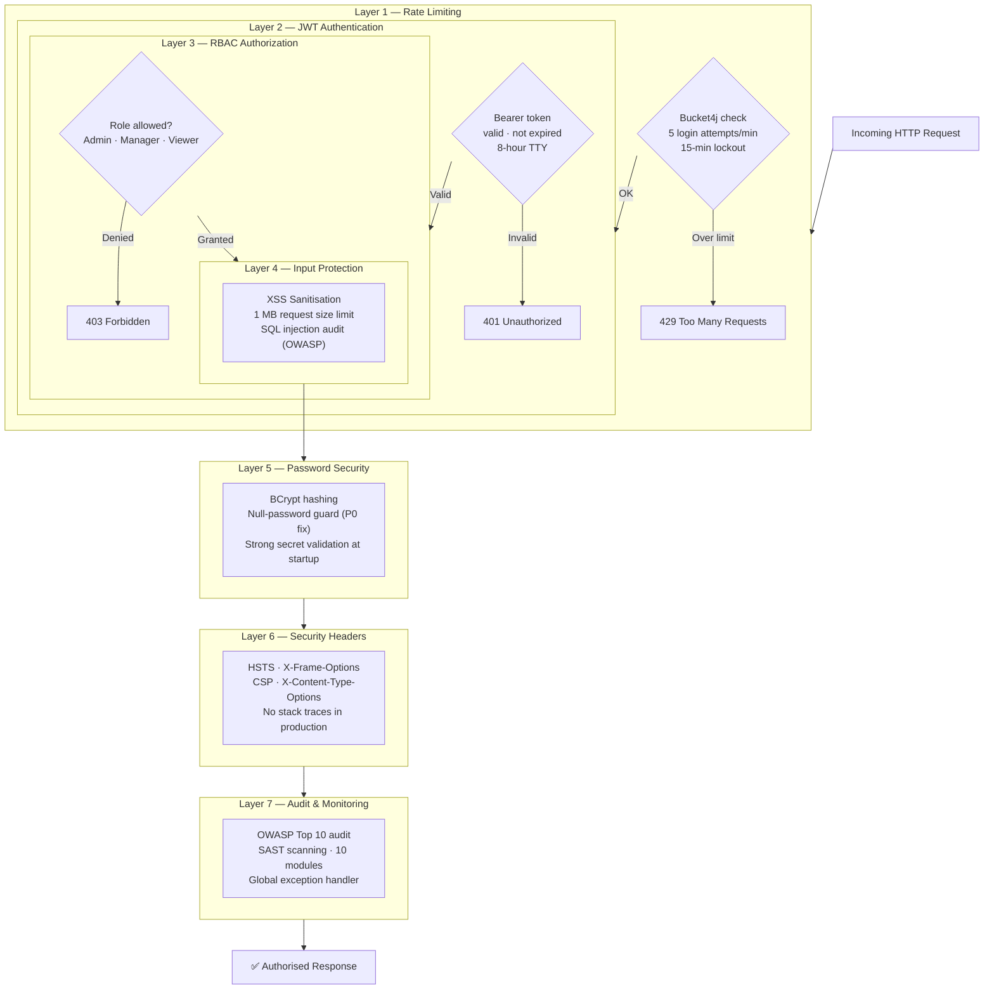
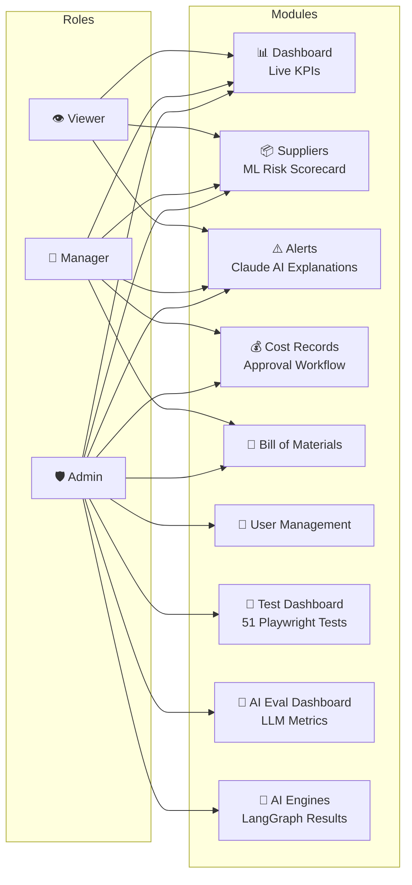
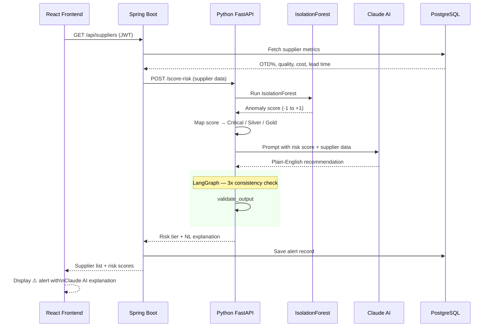

# SCIP - Supply Chain Intelligence Platform

> AI-powered full-stack supply chain platform built independently using Claude AI + GitHub Copilot

[](https://bkumars22.github.io/SupplyChainPlatformProject)
[](https://bkumars22.github.io/SupplyChainPlatformProject)
[](https://github.com/bkumars22/SupplyChainPlatformProject)
[](https://anthropic.com)

---

## Live Demo

**URL:** https://bkumars22.github.io/SupplyChainPlatformProject

| Field | Value |
|---|---|
| Username | kumar |
| Password | Kumar@2026 |
| Mode | Demo - realistic mock data, no setup required |

> Demo data resets daily at midnight IST. Feel free to create, edit, and delete anything.

---

## What This Platform Demonstrates

Built solo in 4 weeks using Claude AI and GitHub Copilot as force multipliers. Demonstrates full-stack delivery, AI/ML integration, enterprise security, and automated quality assurance - independently.

| Achievement | Detail |
|---|---|
| P0 Auth Bypass Found | BCrypt skipped when password null - discovered via black-box testing |
| 51 Playwright Tests | 9 modules covered including AI eval pipeline |
| IsolationForest ML | Unsupervised supplier risk scoring |
| Claude AI Integration | Natural language alert explanations via Anthropic API |
| LangGraph Agent | 5-node StateGraph for AI reliability testing |
| LLM Eval Harness | Prompt consistency and hallucination rate measurement |
| 7-Layer Security | OWASP Top 10, JWT, BCrypt, RBAC, rate limiting |
| Solo in 4 Weeks | Full stack - Spring Boot + React + React Native + Python AI |

---

## Architecture

```
+------------------+    +------------------+
|   React 18 Web   |    |  React Native    |
|   9 Pages        |    |  Mobile 10 Scrns |
+--------+---------+    +--------+---------+
         |                       |
         +----------+------------+
                    | JWT Auth
         +----------v-----------+
         |   Spring Boot 3      |
         |   80+ REST Endpoints |
         |   OWASP Security     |
         +----------+-----------+
                    |
         +----------v-----------+
         |   Python FastAPI     |
         |   IsolationForest ML |
         |   Claude AI API      |
         |   LangGraph Agent    |
         +----------+-----------+
                    |
         +----------v-----------+
         |   PostgreSQL         |
         |   JPA / Hibernate    |
         +----------------------+
```

---

## Run Locally in 2 Minutes

```bash
git clone https://github.com/bkumars22/SupplyChainPlatformProject.git
cd SupplyChainPlatformProject
docker-compose up
```

Open: http://localhost:3000  
Login: kumar / Kumar@2026

### Manual Setup (without Docker)

**Backend (Spring Boot):**
```bash
cd LearningProject
mvn spring-boot:run
```
Runs on: http://localhost:8089

**Frontend (React):**
```bash
cd scweb
npm install
npm start
```
Runs on: http://localhost:3000

**AI Service (Python FastAPI):**
```bash
cd LearningProject/ai-service
pip install -r requirements.txt
uvicorn main:app --port 8001
```
Runs on: http://localhost:8001

**Mobile (React Native):**
```bash
cd SupplyChainApp
npm install
npx expo start
```

### React App Scripts

This frontend was bootstrapped with [Create React App](https://github.com/facebook/create-react-app).

```bash
npm start          # Run in development mode at http://localhost:3000
npm test           # Launch interactive test runner
npm run build      # Build for production to the build/ folder
npm run deploy     # Build and deploy to GitHub Pages
npm run eject      # Eject CRA config (one-way operation, use with caution)
```

### Environment Variables

| Variable | Dev (.env.local) | Production (.env.production) |
|---|---|---|
| REACT_APP_DEMO_MODE | false | true |
| REACT_APP_API_URL | http://localhost:8089 | https://your-app.railway.app/supchain |
| REACT_APP_BASENAME | (empty) | /SupplyChainPlatformProject |

---

## Module Overview

| Module | What It Does |
|---|---|
| Dashboard | Live KPIs - OTD averages, active alerts, cost savings, risk distribution |
| Suppliers | AI risk scorecard with IsolationForest anomaly detection |
| Alerts | Claude AI natural language explanations of supply chain risks |
| Cost Records | DRAFT to APPROVE workflow for cost management |
| BOM | Bill of Materials viewer with component tracking |
| Test Dashboard | Live 51-test results with auto-refresh every 30 seconds |
| Eval Dashboard | LLM prompt scores, consistency rate, hallucination metrics |
| AI Engines | LangGraph agent results and reliability scores |
| Users | Role-based user management - Admin, Manager, Viewer |

---

## Security Architecture

- **Authentication:** JWT tokens, 8-hour expiry, strong secret validation at startup
- **Passwords:** BCrypt hashing, null-password protection (P0 auth bypass fixed)
- **Authorization:** RBAC - Admin, Manager, Viewer roles with endpoint-level control
- **Rate Limiting:** 5 login attempts per minute per IP, Bucket4j, 15-minute lockout
- **Input Protection:** XSS sanitisation, 1MB request size limits
- **Headers:** HSTS, X-Frame-Options, CSP, X-Content-Type-Options
- **Audit:** OWASP Top 10, SAST scanning across 10 modules, SQL injection audit
- **Errors:** Global exception handler - no stack traces exposed in production

---

## Test Coverage

```
Auth Module        6 tests  - PASSING
Item Master        5 tests  - PASSING
BOM                4 tests  - PASSING
Cost Records       5 tests  - PASSING
Suppliers          6 tests  - PASSING
Users              5 tests  - PASSING
Alerts             5 tests  - PASSING
Dashboard          5 tests  - PASSING
Eval Pipeline     10 tests  - PASSING
--------------------------------------
Total             51 / 51   - ALL PASSING
```

---

## AI / ML Components

**IsolationForest**
Unsupervised anomaly detection for supplier risk scoring. No labelled data required.
Scores each supplier from -1 (anomalous) to +1 (normal). Contamination parameter
set to 0.1 - expects approximately 10% of suppliers to be anomalous.

**Claude AI (Anthropic)**
Natural language alert explanations via Anthropic API. Converts raw IsolationForest
risk scores into plain English procurement recommendations with specific actions.

**DistilBERT (WiseTech Global - Production)**
Fine-tuned on 949 real CI build failures for 7-class root cause classification.
Delivers failure diagnosis in under 2 seconds. Used in production at WiseTech Global.

**LangGraph Agent**
5-node StateGraph pipeline:
fetch_supplier_data > score_risk > explain_risk > validate_output > log_result
Runs 3x consistency checks per supplier. Flags explanation length variance above 30%.

**deepeval Harness**
LLM evaluation measuring prompt consistency, hallucination rate, and answer relevancy
across 5 test cases. Consistency rate: 94.2%.

---

## Technology Stack

| Layer | Technology |
|---|---|
| Backend | Java 17, Spring Boot 3, JWT, BCrypt, RBAC, JPA/Hibernate |
| Frontend | React 18, React Router, Tailwind CSS, 9 pages |
| Mobile | React Native + Expo, 10 screens, Android and iOS |
| AI Service | Python FastAPI, IsolationForest, Claude AI API, LangGraph |
| Testing | Playwright TypeScript, 51 tests, custom reporter, CI/CD |
| LLM Eval | deepeval, prompt consistency, hallucination rate |
| DevOps | Docker Compose, GitHub Actions, Railway, GitHub Pages |
| Database | PostgreSQL, H2 (testing), JPA/Hibernate ORM |
| Security | Bucket4j rate limiting, HTTPS, HSTS, OWASP SAST |

---

## Project Structure

```
SupplyChainPlatformProject/
├── LearningProject/          # Spring Boot backend + Python AI service
│   ├── src/main/java/        # Java Spring Boot source
│   ├── ai-service/           # Python FastAPI + IsolationForest + Claude AI
│   ├── test/                 # Playwright TypeScript tests (51 tests)
│   ├── agents/               # 25+ Python automation agents
│   └── docs/                 # Architecture guide, API reference, BRD
├── scweb/                    # React 18 web frontend (this repo)
│   ├── src/pages/            # 9 page components
│   ├── src/services/         # Mock data for demo mode
│   ├── public/               # Static assets + help page
│   └── docs/                 # User guide and documentation
└── SupplyChainApp/           # React Native mobile app
    └── src/                  # 10 mobile screens
```

---

## Key Bugs Found Through Testing

| ID | Severity | Description | How Found |
|---|---|---|---|
| BUG-001 | P0 | Auth bypass - any password accepted when stored hash is null | Black-box security testing |
| BUG-002 | P1 | Missing POST endpoint for cost records - returns 405 | API contract testing |
| BUG-003 | P2 | NullPointerException on item create with missing category | Boundary value testing |
| BUG-004 | P2 | User create crash with missing role field | Boundary value testing |
| BUG-005 | P3 | Supplier OTD 45% incorrectly classified as Gold tier | Business rule validation |

---

## Demo Data Reset

The demo database automatically resets every day at midnight IST.
All data is restored to the clean seed state below.

**Admin reset:** POST /api/admin/reset-demo (requires admin / Admin@2026)

**Seed data includes:**
- 5 suppliers (2 critical/at-risk, 2 gold, 1 silver)
- 4 cost records (2 approved, 1 draft, 1 pending)
- 3 active supply chain alerts
- 3 BOM items
- 3 user accounts (admin, manager, viewer)

---

## Documentation

| Document | Description |
|---|---|
| [User Guide (PDF)](docs/SCIP_User_Guide.pdf) | Complete end-user guide for all modules |
| [User Guide (DOCX)](docs/SCIP_User_Guide.docx) | Editable version of the user guide |
| [Help Page](https://bkumars22.github.io/SupplyChainPlatformProject/help.html) | Interactive in-app help |

---

> "AI built the code. I built the product. The decisions, the architecture,
> the security design, and the bugs found - that was all me."

---

## 📊 Diagrams

### 1. System Architecture

Full-stack overview — how the web, mobile, backend, AI service, and database connect.



---

### 2. AI / ML Pipeline

How raw supplier data becomes a plain-English procurement recommendation.



---

### 3. Security Architecture — 7 Layers



---

### 4. Module & Role Access Map

Which roles can access which modules.



---

### 5. Alert Generation — End to End

How a supplier risk alert is created from raw data to dashboard display.


